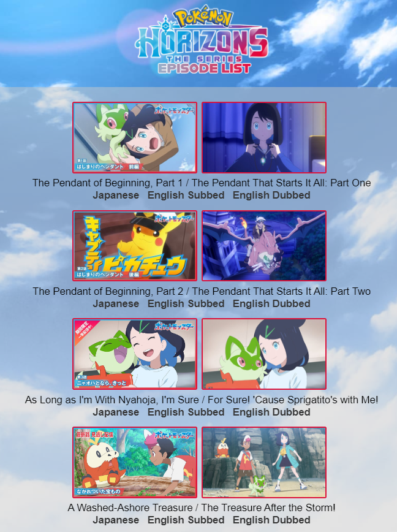
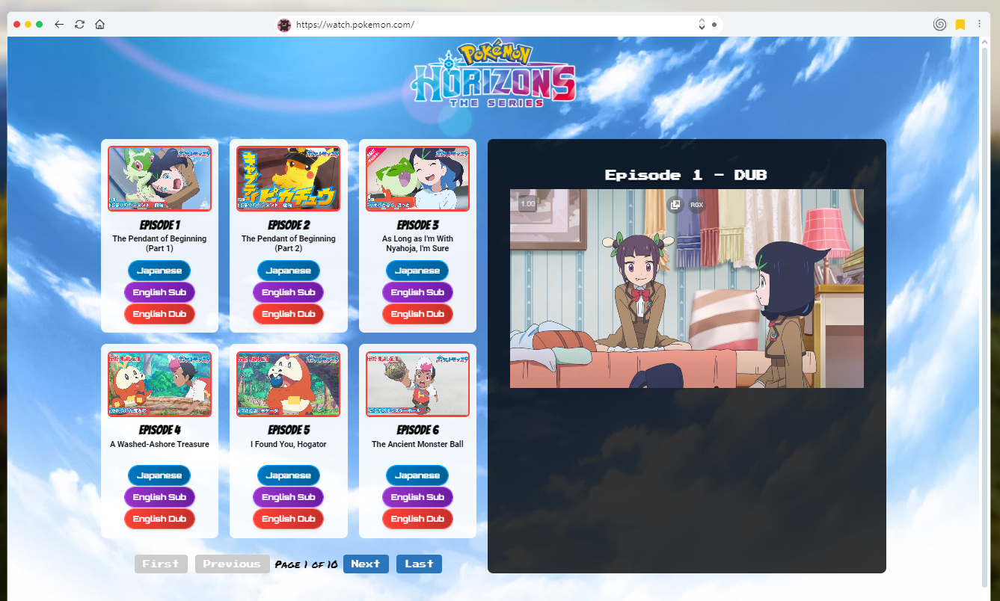

# NOTE
This repository is no longer being maintained due to TPC taking down the main archive silently from the Internet Archive without an email being sent that said it was removed. Due to this, I won't be able to provide the episodes any longer. The original details of the repository can be seen below.
# POKÉMON HORIZONS: THE SERIES Episode List
This is a website to easily access Pokémon Horizons episodes in Japanese, Subbed and Dubbed in English!
 This repository does not include every current episode, but is instead uploaded on an alternative site.
 Episodes were obtained from these links:
 - https://archive.org/details/PokemonHorizonsJP [DELETED BY TPC]
 - https://archive.org/details/PokemonHorizonsEN_BBC
## Features
- Japanese episodes uploaded to YouTube (for approx. a week per episode)
- English Subbed episodes from a random website I found
- English Dubbed episodes from BBC iPlayer (currently, dunno about Netflix)
## How to Use
### Messaging Services (NOT BEING MAINTAINED)
If you want to embed these episodes in messaging services, you can link this website (https://pokermmon.github.io) then afterwards, enter a slash, then specify if its jp, en_s, or en_d, then another slash and the episode number. Once sent, this will embed a video link to the video with the thumbnail (if both are available).
 ***EXAMPLE:***
 
### Website (NOT BEING MAINTAINED)
If you go to the main website, you will see an episode list with the episode number, episode name (in JP/EN), and the JP, Subbed, and Dubbed versions will be linked below them.
 
### Website (Websim.ai) (NOT BEING MAINTAINED)
This was created mostly using Claude Sonnet 3.5. It is the same premisis as the github.io site, but significantly better than the github site (plus it has a video player on the side!)
 
